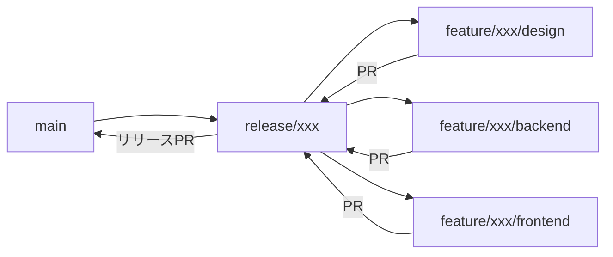

# ブランチ戦略（Feature Branch Flow）

## 概要

本プロジェクトでは、機能単位でリリースブランチを作成し、段階的にPRを分割してレビューを効率化するブランチ戦略を採用しています。

## ブランチ構成

```
main ──► release/{機能名} ──┬── feature/{機能名}/design
                           ├── feature/{機能名}/backend
                           ├── feature/{機能名}/frontend
                           └──► main（本番）
```

### ブランチの役割

| ブランチ | 用途 | ライフサイクル |
|----------|------|----------------|
| `main` | 本番環境（Vercel自動デプロイ） | 永続 |
| `release/{機能名}` | 機能の統合ブランチ | 機能開発中のみ |
| `feature/{機能名}/{種別}` | 分割PR用ブランチ | PR完了まで |

### 種別の分類

| 種別 | 内容 | 対象ファイル |
|------|------|--------------|
| `design` | 設計ドキュメント | `docs/steering/` |
| `backend` | API・DB実装 | `src/app/api/`, `prisma/`, `src/types/` |
| `frontend` | UI・フック実装 | `src/components/`, `src/hooks/` |

## ワークフロー

### 1. 新機能追加（`/add-feature`）



#### Phase 1開始時（ブランチ準備）

```bash
git checkout main && git pull origin main
git checkout -b release/{機能名}
git push -u origin release/{機能名}
git checkout -b feature/{機能名}/design
```

#### Phase 3完了時（設計PR）

```bash
git add docs/steering/{機能名}/
git commit -m "docs({機能名}): add design documents"
git push -u origin feature/{機能名}/design

gh pr create \
  --base release/{機能名} \
  --title "📝 [{機能名}] 設計ドキュメント" \
  --body "..."
```

#### Phase 4 バックエンド完了時

```bash
git checkout release/{機能名}
git pull origin release/{機能名}
git checkout -b feature/{機能名}/backend

git add src/app/api/ src/types/ prisma/ __tests__/api/
git commit -m "feat({機能名}): implement backend API"
git push -u origin feature/{機能名}/backend

gh pr create \
  --base release/{機能名} \
  --title "🔧 [{機能名}] バックエンド実装" \
  --body "..."
```

#### Phase 4 フロントエンド完了時

```bash
git checkout release/{機能名}
git pull origin release/{機能名}
git checkout -b feature/{機能名}/frontend

git add src/hooks/ src/components/ __tests__/components/
git commit -m "feat({機能名}): implement frontend UI"
git push -u origin feature/{機能名}/frontend

gh pr create \
  --base release/{機能名} \
  --title "🎨 [{機能名}] フロントエンド実装" \
  --body "..."
```

#### 全Phase完了時（リリースPR）

```bash
git checkout release/{機能名}
git pull origin release/{機能名}

gh pr create \
  --base main \
  --title "🚀 [{機能名}] リリース" \
  --body "..."
```

### 2. バグ修正（`/fix-bug`）

#### 小規模修正（〜200行）

従来通り直接 `main` へPR：

```bash
git checkout main && git pull origin main
git checkout -b fix/{バグ名}
# 修正
git push -u origin fix/{バグ名}
gh pr create --base main
```

#### 大規模修正（200行超）

新機能と同様に `release/fix-{バグ名}` を作成：

```bash
git checkout main && git pull origin main
git checkout -b release/fix-{バグ名}
git push -u origin release/fix-{バグ名}
# 以降は新機能と同様のフロー
```

### 3. 機能修正（`/modify-feature`）

バグ修正と同様の基準で判断：
- 小規模（〜200行）: `modify/{機能名}` → `main`
- 大規模（200行超）: `release/modify-{機能名}` を作成

## PR分割の基準

| PRサイズ | 推奨対応 |
|----------|----------|
| 〜200行 | 分割不要、直接main |
| 200〜500行 | 2PR分割（設計 + 実装） |
| 500行超 | 3-4PR分割（設計 + BE + FE + 統合） |

## 緊急修正（Hotfix）

本番で緊急対応が必要な場合：

```bash
git checkout main && git pull origin main
git checkout -b hotfix/{問題名}
# 最小限の修正
git push -u origin hotfix/{問題名}
gh pr create --base main --title "🔥 [Hotfix] {問題名}"
```

## 注意事項

### マージ順序

1. 設計PR → release/{機能名}
2. バックエンドPR → release/{機能名}
3. フロントエンドPR → release/{機能名}
4. リリースPR → main

**重要**: 各PRは前のPRがマージされてからマージすること

### ブランチのクリーンアップ

機能完了後、不要になったブランチは削除：

```bash
git branch -d feature/{機能名}/design
git branch -d feature/{機能名}/backend
git branch -d feature/{機能名}/frontend
git branch -d release/{機能名}
git push origin --delete feature/{機能名}/design
git push origin --delete feature/{機能名}/backend
git push origin --delete feature/{機能名}/frontend
git push origin --delete release/{機能名}
```

### コンフリクトの解消

`release/{機能名}` にマージする際にコンフリクトが発生した場合：

```bash
git checkout feature/{機能名}/{種別}
git fetch origin
git rebase origin/release/{機能名}
# コンフリクト解消
git push --force-with-lease
```
