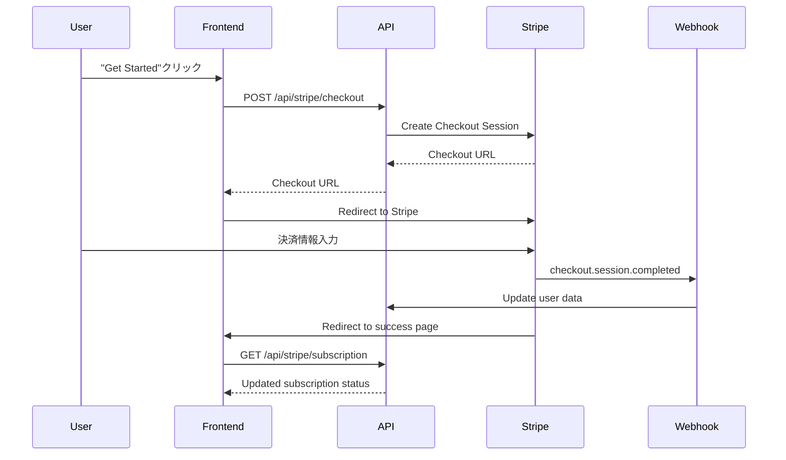
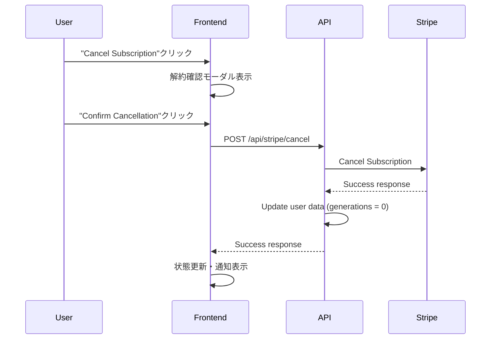

# Solo Speak - サブスクリプションシステム詳細ドキュメント

## 概要

Solo SpeakのサブスクリプションシステムはStripeを使用した月額課金システムです。ユーザーは月額500円でBasicプランに登録でき、1日5回までのAIフレーズ生成、音読回数カウント、クイズ機能を利用できます。

## アーキテクチャ

### 主要コンポーネント

1. **フロントエンド**: Next.js 14 (App Router)
2. **バックエンド**: Next.js API Routes
3. **決済処理**: Stripe
4. **データベース**: Prisma ORM
5. **認証**: 既存の認証システム

### システム構成図

```
[フロントエンド] ←→ [API Routes] ←→ [Stripe API]
       ↓              ↓
   [React State]  [Prisma ORM]
                     ↓
                 [Database]
```

## データベーススキーマ

### Userテーブル拡張

```prisma
model User {
  id                         String    @id @default(cuid())
  email                      String    @unique
  stripeCustomerId          String?   // Stripe顧客ID
  remainingPhraseGenerations Int       @default(0) // 残りフレーズ生成回数
  lastPhraseGenerationDate  DateTime? // 最後の生成日（日次リセット用）
  // ... その他のフィールド
}
```

## API エンドポイント

### 1. サブスクリプション状態取得 (`GET /api/stripe/subscription`)

**目的**: ユーザーの現在のサブスクリプション状態を取得

**レスポンス例**:

```json
{
	"hasStripeCustomer": true,
	"subscription": {
		"isActive": true,
		"status": "active",
		"currentPeriodEnd": "2025-09-04T00:00:00.000Z",
		"productId": "prod_xxx"
	},
	"serverTime": "2025-08-04T12:00:00.000Z",
	"serverTimezone": "UTC"
}
```

**処理フロー**:

1. 認証チェック
2. ユーザーのstripeCustomerIdを取得
3. Stripe APIでサブスクリプション情報を取得
4. billing_cycle_anchorから次回請求日を計算
5. レスポンス返却

### 2. チェックアウトセッション作成 (`POST /api/stripe/checkout`)

**目的**: StripeチェックアウトページのURLを生成

**レスポンス例**:

```json
{
	"checkoutUrl": "https://checkout.stripe.com/c/pay/xxx"
}
```

**処理フロー**:

1. 認証チェック
2. Stripe顧客が存在しない場合は作成
3. チェックアウトセッションを作成
4. 成功・キャンセル時のリダイレクトURL設定

### 3. サブスクリプション解約 (`POST /api/stripe/cancel`)

**目的**: サブスクリプションを即座に解約

**レスポンス例**:

```json
{
	"success": true,
	"message": "Subscription canceled successfully"
}
```

**処理フロー**:

1. 認証チェック
2. アクティブなサブスクリプションを取得
3. Stripe APIで即座に解約実行
4. データベースの生成回数を0にリセット

### 4. フレーズ生成回数管理 (`GET/POST /api/user/phrase-generations`)

#### GET: 残り生成回数取得

**レスポンス例**:

```json
{
	"remainingGenerations": 5,
	"lastGenerationDate": "2025-08-04T00:00:00.000Z",
	"hasActiveSubscription": true
}
```

**処理フロー**:

1. 認証チェック
2. サブスクリプション状態確認
3. 日次リセットロジック実行
4. サブスクリプション有効かつ生成回数0の場合は即座にリセット
5. 残り回数を返却

#### POST: 生成回数減算

**処理フロー**:

1. 認証チェック
2. 残り回数チェック
3. 回数を1減算
4. 最後の生成日を更新

### 5. Webhookハンドラー (`POST /api/stripe/webhook`)

**目的**: Stripeイベントの処理

**処理イベント**:

- `checkout.session.completed`: チェックアウト完了
- `customer.subscription.created`: サブスクリプション作成
- `customer.subscription.updated`: サブスクリプション更新
- `customer.subscription.deleted`: サブスクリプション削除
- `invoice.payment_succeeded`: 決済成功
- `invoice.payment_failed`: 決済失敗

## フレーズ生成回数管理ロジック

### 基本ルール

1. **無料ユーザー**: 生成回数は常に0
2. **サブスクリプションユーザー**: 1日5回まで
3. **日次リセット**: 毎日0時にリセット
4. **即座リセット**: サブスクリプション登録時に即座に5回付与

### リセットタイミング

1. **初回登録時**: サブスクリプション登録完了時に5回設定
2. **日次リセット**: 最後の生成日が今日より前の場合
3. **サブスクリプション有効化時**: 生成回数が0の場合に即座にリセット
4. **Webhook処理**: Stripeイベント受信時

### コード例

```typescript
// 日次リセットロジック
const today = new Date();
today.setHours(0, 0, 0, 0);

if (!lastGenerationDate || lastGenerationDay.getTime() < today.getTime()) {
	if (hasActiveSubscription) {
		remainingGenerations = 5;
		await updateUser({ remainingPhraseGenerations: 5 });
	} else {
		remainingGenerations = 0;
		await updateUser({ remainingPhraseGenerations: 0 });
	}
}
```

## フロントエンド実装

### SubscriptionTab コンポーネント

**場所**: `src/components/settings/SubscriptionTab.tsx`

**主要機能**:

1. サブスクリプション状態表示
2. 次回請求日/期限日表示
3. プラン詳細表示
4. 登録/解約ボタン
5. 解約確認モーダル

**状態管理**:

```typescript
interface SubscriptionStatus {
	hasStripeCustomer: boolean;
	subscription: {
		isActive: boolean;
		status?: string;
		currentPeriodEnd?: string;
	};
}
```

### 状態表示ロジック

```typescript
const getStatusDisplayText = () => {
	if (!isSubscribed) return "No Subscribe";
	if (status === "canceled") return "Basic Plan (Canceled)";
	return "Basic Plan";
};
```

### PhraseAdd コンポーネント統合

**場所**: `src/components/phrase/PhraseAdd.tsx`

**統合ポイント**:

1. 残り生成回数表示
2. サブスクリプション促進メッセージ（非登録者のみ）
3. 生成ボタンの有効/無効制御

## 決済フロー

### 1. サブスクリプション登録



### 2. サブスクリプション解約



## ユーティリティ関数

### stripe-helpers.ts

**場所**: `src/utils/stripe-helpers.ts`

**主要関数**:

#### getUserSubscriptionStatus

```typescript
export async function getUserSubscriptionStatus(
	customerId: string,
): Promise<SubscriptionInfo> {
	// Stripeからサブスクリプション情報を取得
	// billing_cycle_anchorから次回請求日を計算
	// SubscriptionInfo形式で返却
}
```

#### createCheckoutSession

```typescript
export async function createCheckoutSession(
	customerId: string,
	priceId: string,
	successUrl: string,
	cancelUrl: string,
): Promise<string> {
	// Stripeチェックアウトセッションを作成
	// セッションURLを返却
}
```

#### cancelSubscription

```typescript
export async function cancelSubscription(
	subscriptionId: string,
): Promise<boolean> {
	// サブスクリプションを即座に解約
	// 成功/失敗を返却
}
```

## エラーハンドリング

### フロントエンド

1. **API エラー**: toast通知で表示
2. **ネットワークエラー**: リトライ機能
3. **認証エラー**: ログインページリダイレクト

### バックエンド

1. **Stripe API エラー**: 詳細ログ記録
2. **データベースエラー**: トランザクション保護
3. **認証エラー**: 401レスポンス

## セキュリティ

### 1. Webhook検証

```typescript
const sig = headers.get("stripe-signature");
const event = stripe.webhooks.constructEvent(body, sig, endpointSecret);
```

### 2. 認証チェック

全てのAPIエンドポイントで`authenticateRequest`を実行

### 3. 入力検証

- ユーザーIDの検証
- Stripe顧客IDの検証
- 生成回数の上限チェック

## 環境変数

### 必須設定

```env
# Stripe設定
STRIPE_SECRET_KEY=sk_test_xxx
STRIPE_PUBLISHABLE_KEY=pk_test_xxx
STRIPE_WEBHOOK_SECRET=whsec_xxx
STRIPE_BASIC_PLAN_PRICE_ID=price_xxx

# アプリケーション設定
NEXT_PUBLIC_SITE_URL=http://localhost:3000
```

## トラブルシューティング

### よくある問題

#### 1. 生成回数がリセットされない

**原因**:

- Webhookが届いていない
- サブスクリプション状態の判定エラー
- 日次リセットロジックのバグ

**対処法**:

1. Webhook配信状況確認
2. `/api/stripe/subscription`レスポンス確認
3. データベースの`lastPhraseGenerationDate`確認

#### 2. 決済後に状態が更新されない

**原因**:

- キャッシュが更新されていない
- Webhookの遅延

**対処法**:

1. データ再取得でキャッシュクリア
2. ページリロード
3. Webhook配信ログ確認

#### 3. 解約後も機能が使える

**原因**:

- 即座解約の設定ミス
- 期間終了までのアクセス権

**対処法**:

1. Stripe Dashboardで解約状態確認
2. `cancel_at_period_end`フラグ確認

## 今後の拡張予定

### 1. 複数プラン対応

- Proプラン追加（1日20回生成）
- 年額プラン追加
- プラン変更機能

### 2. 使用量分析

- 生成回数の統計
- 利用パターン分析
- ダッシュボード追加

### 3. 決済方法拡張

- PayPal連携
- 銀行振込対応
- 法人向けプラン

## テスト

### 1. 単体テスト

- API エンドポイントのテスト
- ユーティリティ関数のテスト
- バリデーション機能のテスト

### 2. 統合テスト

- 決済フローのエンドツーエンドテスト
- Webhook処理のテスト
- エラーケースのテスト

### 3. 本番環境テスト

- Stripe本番環境での決済テスト
- パフォーマンステスト
- セキュリティテスト

## デプロイメント

### 1. 環境設定

1. Stripe本番アカウント設定
2. Webhook URL設定
3. 環境変数設定

### 2. データベースマイグレーション

```bash
npx prisma migrate deploy
```

### 3. Webhook設定

Stripeダッシュボードで以下のイベントを設定:

- `checkout.session.completed`
- `customer.subscription.created`
- `customer.subscription.updated`
- `customer.subscription.deleted`
- `invoice.payment_succeeded`
- `invoice.payment_failed`

## 監視とログ

### 1. ログ監視

- API レスポンス時間
- エラー率
- Webhook処理状況

### 2. メトリクス

- 登録者数
- 解約率
- 収益推移

### 3. アラート

- 決済失敗
- Webhook エラー
- システムエラー

## まとめ

Solo SpeakのサブスクリプションシステムはStripeを基盤とした堅牢な設計となっています。フレーズ生成回数の管理、決済処理、状態管理が適切に実装されており、ユーザーエクスペリエンスとビジネス要件の両方を満たしています。

今後の機能拡張や保守において、このドキュメントを参考に一貫性のある開発を進めることができます。
